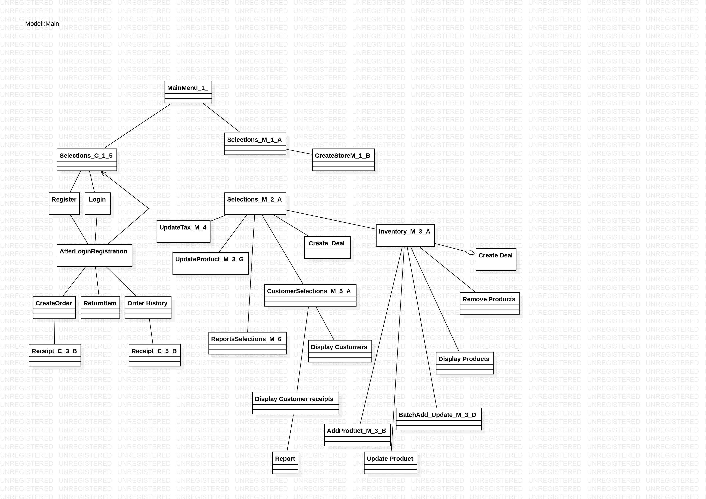

# This is My Grocery Store Project
### I worked on this myself as a side project and the code was build using Java and an IDE called Intellj. I used Java Swing to create the GUI. 

## How to install:
1. Clone the repository: https://github.com/skytruong90/Grocery_Store_GUI.git
2. The main code is inside the code folder when you download everything.
3. Run the project with any IDE.

## My Objective: 
### To create a GUI based system that allows a user to manage a grocery store with all the different products. The system can be used to generate various reports about products and prices of those products.

## Mapping out the interaction between each applications:

## Files:
"Mock_GUI_1" is a word document of what I want the GUI to look like once everything is finished. You can view the doc by clicking on it and viewing it on Words.

"User_Stories" is an excel document of what and why I ranked as my priorities.
